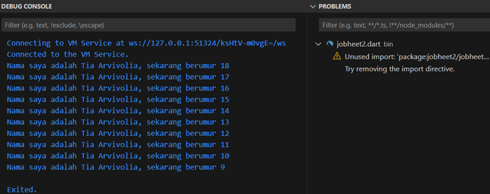

# Tugas Praktikum

## Soal 1: 

## Soal 2: Mengapa sangat penting untuk memahami bahasa pemrograman Dart sebelum kita menggunakan framework Flutter?

### Jawaban:
Memahami bahasa pemrograman Dart sebelum menggunakan framework Flutter sangat penting karena **Dart** adalah bahasa utama yang digunakan untuk menulis kode Flutter. Pengetahuan tentang Dart membantu developer dalam hal berikut:
- Memahami **sintaksis dan struktur kode** yang diperlukan.
- Menulis kode yang lebih **efisien** dan optimal.
- Memaksimalkan penggunaan fitur seperti **asynchronous programming**.
- Mempermudah dalam **debugging**, pemeliharaan aplikasi, dan integrasi dengan berbagai **library dan package** yang tersedia di ekosistem Flutter.

## Soal 3: Poin-Poin Penting dari Codelab Flutter

Berikut adalah rangkuman dari poin-poin penting yang dapat membantu proses pengembangan aplikasi mobile menggunakan Flutter:

1. **Pengantar Bahasa Pemrograman Dart**: 
   - Dart adalah bahasa pemrograman utama Flutter yang mendukung **pemrograman berorientasi objek** dan memiliki fitur modern.

2. **Getting Started with Dart**:
   - **Productive Tooling**: Memanfaatkan fitur analisis kode, plugin IDE, dan ekosistem paket.
   - **Garbage Collection**: Mengelola memori untuk objek yang tidak digunakan.
   - **Type Annotations (Opsional)**: Menjamin keamanan dan konsistensi data.
   - **Statically Typed**: Menggunakan type-safe dan type inference untuk menemukan bug selama kompilasi.
   - **Portability**: Dart dapat dikompilasi ke JavaScript dan kode native ARM/x86.

3. **The Evolution of Dart**:
   - Dari fokus awal pada web, kini Dart lebih berorientasi pada **pengembangan mobile** dengan Flutter.
   - Mengatasi kelemahan JavaScript dengan alat modern dan performa tinggi.
   - Menyeimbangkan **fleksibilitas** dan **ketangguhan** dengan fitur OOP dan type annotations opsional.

4. **How Dart Works**:
   - **Dart Virtual Machines (VMs)** dan **JavaScript Compilation**: Kode Dart dapat dieksekusi dalam mode JIT (Just-In-Time) untuk pengembangan dan AOT (Ahead-Of-Time) untuk performa tinggi.
   - **Hot Reload**: Memungkinkan umpan balik cepat terhadap perubahan kode, mendukung pengembangan yang efisien.

5. **Introducing the Structure of Dart Language**:
   - **Object Orientation (OOP)**: Dart menggunakan kelas untuk mendefinisikan objek, dengan fitur seperti enkapsulasi, pewarisan, komposisi, abstraksi, dan polimorfisme.
   - **Operator Dart**: Operator di Dart diimplementasikan sebagai metode dalam kelas. Contoh operator: aritmatika (+, -, *, /), kesetaraan (==, !=), dan logika (!, ||, &&).
   - **Perilaku Operator**: Operator bekerja pada tipe data numerik dan string. Operator logika bekerja pada tipe **bool**.
   - **Type Safety**: Operator == membandingkan nilai, bukan referensi, karena Dart mendukung .**type safety** secara bawaan.
